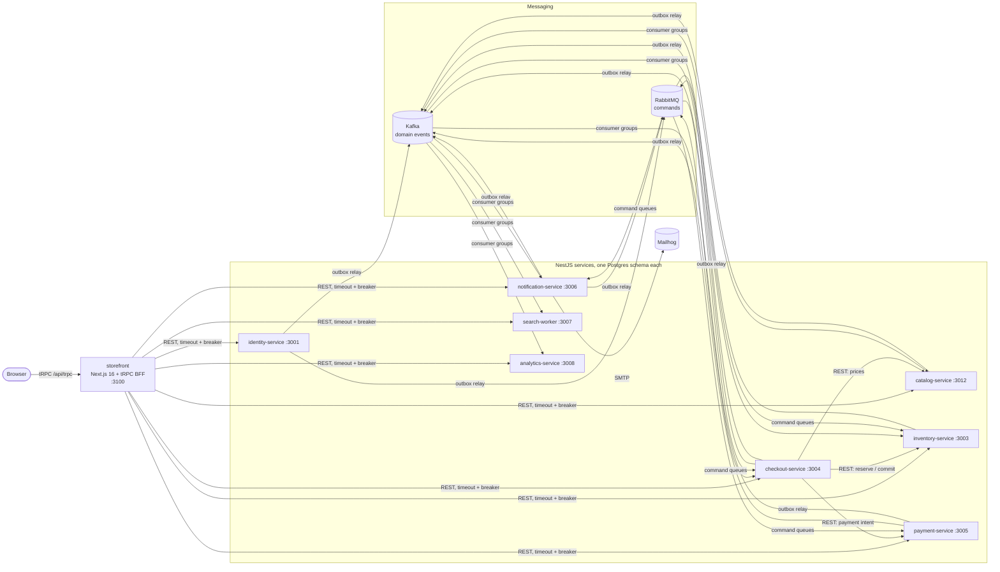

# Meridian

Meridian is a demo furniture shop built as a small microservices platform. You can browse 23 pieces, filter and search them, add them to a cart, check out as a guest or signed-in shopper, pay, get emails and a PDF invoice, cancel, return and get refunded. Admins run orders, stock, products, coupons and a System page that shows breakers, queues, dead letters and consumer lag.

**Nothing here is real commerce.** Payments run in Stripe's test mode and email is sandbox only, and both rules are enforced in code (see [Security notes](docs/ARCHITECTURE.md#security-notes)):

- Payments go through **Stripe in test mode**: a real Stripe PaymentIntent, Stripe's Payment Element in the checkout, and signed webhooks back to payment-service. No money moves, and payment-service refuses to start with a live Stripe key (`sk_live_`, `rk_live_`, `pk_live_`). Without Stripe keys it falls back to a local sandbox where nothing leaves the machine. A Paddle **sandbox** adapter is kept as a second, inactive adapter: Paddle was dropped because its terms do not allow physical goods, and Meridian sells furniture.
- All mail goes to Mailhog. The notification service refuses to start if `SMTP_HOST` is not a local mail catcher.
- The captcha is Cloudflare Turnstile with Cloudflare's official **test keys**, which always pass.

The project is there to show four things in working code: bounded contexts (DDD), clean architecture inside each service, CQRS, and the messaging and resilience patterns that hold a distributed system together. Each pattern is used by a real feature and can be shown live.

## Architecture at a glance



There are three ways services talk:

| Channel | Used for | Why |
|---|---|---|
| **Synchronous REST** | The BFF calling services; checkout calling catalog, inventory and payment while it places an order | The caller needs the answer right now: the price, whether stock was reserved, the payment intent. Every call has a timeout, a circuit breaker and a correlation id. |
| **Kafka** (domain events) | Facts such as `OrderPaid` or `ProductPublished`, one topic per bounded context | Many independent readers (search, analytics, email) can each build their own view. The log can be replayed to rebuild a read model. |
| **RabbitMQ** (commands) | Work that must happen once, such as `notification.send-email` or `payment.refund` | A command has exactly one owner and needs per-message retry tiers, a dead-letter queue and a replay button. |

Every message leaves a service through a **transactional outbox**, in the same database transaction as the state change. Every consumer is idempotent: it keeps an **inbox** or uses natural idempotency keys. The full design is in [docs/ARCHITECTURE.md](docs/ARCHITECTURE.md).

## Tech stack

| Area | Choice |
|---|---|
| Language and runtime | TypeScript 5.9, Node.js 24, npm workspaces + Turborepo |
| Services | NestJS 11 with `@nestjs/cqrs`, zod 4 validation |
| Persistence | PostgreSQL 16, one schema per service, Prisma 6 (`prisma db push`, no migrations folder) |
| Search | Postgres full-text search (`tsvector`) with `pg_trgm` for typo tolerance and facets. No OpenSearch. |
| Messaging | Kafka 3.9 (kafkajs) for events, RabbitMQ 3 (amqplib) for commands |
| Cache, rate limits, chaos rules | Redis 7 (ioredis) |
| Resilience | opossum circuit breakers, per-call timeouts, ordered graceful shutdown |
| Storefront | Next.js 16 App Router, React 19, tRPC 11 BFF, Tailwind CSS 4, shadcn/ui on Radix |
| Object storage | SeaweedFS (S3 API) for product images and invoice PDFs |
| Observability | JSON logs with correlation and trace ids, Prometheus-format `/metrics`, OpenTelemetry traces in Jaeger |
| Payments / email / captcha | Stripe test mode (PaymentIntents + Payment Element, `stripe` 22 SDK, webhooks through the Stripe CLI locally), local sandbox fallback, Paddle sandbox adapter kept / Mailhog / Cloudflare Turnstile test keys |
| Tests | Vitest (unit and system), Playwright (e2e) |
| Deployment artefacts | Multi-stage Dockerfiles for every service and the storefront, Docker Compose for infrastructure and the containerised apps, a Helm chart in `infra/k8s/helm/meridian` |

## Prerequisites

- Node.js 24 or newer and npm 11 (`package.json` pins `npm@11.12.1`).
- Docker with Compose v2.
- `curl`, `bash` and `setsid` (util-linux). The dev scripts use them to start services detached.
- A machine with enough memory for Kafka, RabbitMQ, Postgres, Jaeger, SeaweedFS and nine Node processes at once. Avoid running several TypeScript builds in parallel on a 16 GB laptop.
- The Stripe CLI for webhooks in development: `npm i -g @stripe/cli` (no sudo needed), and a Stripe account in test mode (a free sandbox is enough).
- Free ports: 3001, 3003–3008, 3012, 3100 (plus 3200, 13001, 13003–13008 and 13012 for the Docker apps profile), 5434, 6380, 5672, 15672, 9092, 9000, 1025, 8025, 16686, 4317, 4318, plus 8080 if you want Kafka UI.

## Quick start

```bash
npm ci                      # install every workspace
npm run bootstrap           # creates .env from .env.example, starts core infra, runs init jobs,
                            # pushes the eight Prisma schemas, builds the shared packages
npm run dev:api             # builds and starts the eight services detached on their ports
npm run seed                # admin user, catalog (publishes ProductPublished), coupons; stock follows via Kafka
npm run dev:store           # storefront on http://localhost:3100
```

Open **http://localhost:3100**.

### Stripe test mode

Put your Stripe **test** keys in `.env` (Dashboard → Developers → API keys, test mode): `STRIPE_SECRET_KEY` (`sk_test_…` or a restricted `rk_test_…`), `STRIPE_PUBLISHABLE_KEY` and `NEXT_PUBLIC_STRIPE_PUBLISHABLE_KEY` (`pk_test_…`). Then let Stripe's events reach your laptop:

```bash
npm run stripe:secret -w payment-service   # stores the `stripe listen` signing secret as STRIPE_WEBHOOK_SECRET in .env
bash scripts/stop-api.sh payment-service && bash scripts/dev-api.sh payment-service   # pick up the secret
npm run stripe:listen -w payment-service   # forwards test events to localhost:3005/webhooks/stripe (keep it running)
```

To keep the listener running in the background, start it as a user service: `systemd-run --user --unit=meridian-stripe-listen --setenv=PATH="$PATH" bash scripts/stripe-listen.sh` (and `--unit=meridian-stripe-listen-docker … --port 13005` for the Docker stack). `journalctl --user -u meridian-stripe-listen -f` shows every forwarded event.

Pay with test card `4242 4242 4242 4242`, any future expiry and any CVC. `4000 0000 0000 0002` is declined and `4000 0025 0000 3155` asks for 3-D Secure. Refunds from the admin order page go back to the card on Stripe. `PAYMENT_PROVIDER=local` (or no Stripe keys) switches to the local sandbox; `PAYMENT_PROVIDER=paddle` uses the retained Paddle sandbox adapter.

Notes:

- `npm run infra:up` starts only the core Compose profile (Postgres, Redis, RabbitMQ, Kafka, SeaweedFS, Mailhog, Jaeger and the one-shot init jobs). `npm run bootstrap` already does this. Run it on its own when the containers are stopped and the schemas already exist.
- `npm run infra:tools` adds Kafka UI on http://localhost:8080 (Compose profile `tools`).
- `npm run dev:api` writes logs to `/tmp/meridian-logs/<service>.log` and pid files to `/tmp/meridian-logs/pids/`. You can start a subset with `bash scripts/dev-api.sh --skip-build checkout-service payment-service`.
- `npm run stop:api` stops every service gracefully with SIGTERM and reports any process that had to be killed.
- `npm run sync-env` adds keys that are new in `.env.example` to an existing `.env`. It never rewrites your values and prints key names only.
- The storefront reads the root `.env` (see `apps/storefront/next.config.ts`), so one file configures everything.

### Admin credentials

`npm run seed` creates the admin user from **`ADMIN_EMAIL`** and **`ADMIN_PASSWORD`** in your `.env`. Sign in at http://localhost:3100/account with those values, then open http://localhost:3100/admin.

In development, if `NEXT_PUBLIC_DEMO_ADMIN_EMAIL` and `NEXT_PUBLIC_DEMO_ADMIN_PASSWORD` are set, the sign-in form shows them as a hint. Production builds never show the hint (`apps/storefront/components/account/AuthPanel.tsx`).

## Run everything in Docker

Every service and the storefront also run as containers (Compose profile `apps`), next to the core infrastructure.

```bash
npm run docker:build        # builds the 10 images in parallel: meridian/<service>:local, storefront, migrate
MERIDIAN_APPS_NODE_ENV=development npm run docker:up   # core infra + migrate job + 9 apps, waits until healthy
npm run docker:seed         # optional, same seed as `npm run seed` against the container ports
npm run docker:down         # stops and removes the app containers only (core infra keeps running)
```

Open **http://localhost:3200**. Services publish `/health/*` and `/metrics` on 127.0.0.1:13001 (identity), 13012 (catalog), 13003 (inventory), 13004 (checkout), 13005 (payment), 13006 (notification), 13007 (search) and 13008 (analytics). Inside the network they use their contract ports and compose DNS names.

- **Images.** `infra/docker/Dockerfile.service` builds any NestJS service (`--build-arg SERVICE=<name> --build-arg PORT=<port>`): `npm ci` with a cache mount, the shared packages once, `prisma generate` and `tsc` for the service, then a `node:24-bookworm-slim` runtime with production dependencies only, user `node` (uid 1000), `NODE_ENV=production`, `EXPOSE` of the contract port and a `HEALTHCHECK` on `/health/live`. `infra/docker/Dockerfile.storefront` builds the Next.js standalone server; `NEXT_PUBLIC_*` values are build args because Next inlines them. Node runs as the main process with exec-form `CMD`, so SIGTERM reaches the kit's graceful shutdown (Compose adds `init: true` and a 40 s stop grace period).
- **Schemas.** The one-shot `migrate` service (image `meridian/migrate:local`, target `migrate`) runs `prisma db push --skip-generate` for all eight schemas and then `init-schemas.sql`, exactly like `npm run bootstrap`. It never passes `--force-reset` or `--accept-data-loss`, so a destructive schema change fails the job instead of dropping data. The apps start only after it succeeds.
- **Isolation from the dev stack.** The containers share Postgres, Redis, RabbitMQ, Kafka and SeaweedFS with `npm run dev:api`, but use their own database `meridian_docker` (`MERIDIAN_APPS_DB`), messaging namespace `docker` (topics, queues and consumer groups) and Redis prefix `docker:`. The two stacks never consume each other's messages or outbox rows, and the dev schemas are never touched.
- **Configuration.** `infra/docker/apps.env` holds the in-network settings (hostnames such as `postgres`, `kafka:29092`, `minio:9000`). Put overrides in `infra/docker/apps.env.local` (git-ignored). `NODE_ENV` defaults to `production`, where the dev-only `/seed` and chaos endpoints return 404. Start with `MERIDIAN_APPS_NODE_ENV=development` if you want to seed. The storefront port can be changed with `MERIDIAN_STOREFRONT_PORT`.
- **Kubernetes.** `npm run k8s:kind -- --build` builds the images, loads them into the kind cluster with `kind load docker-image` and installs the Helm chart, which expects the same `meridian/<service>:local` names and ports. The chart does not run the migrate job, so run `meridian/migrate:local` once against the cluster database with the eight `<SVC>_DATABASE_URL` variables.
- **Memory.** A parallel build of all images peaks at several GB (eight `tsc` compiles, a Next.js build and the installs). The builds are capped with `BUILD_NODE_OPTIONS` build args (`--max-old-space-size=1024` for services, `2048` for the storefront).

## Useful URLs

| What | URL | Notes |
|---|---|---|
| Storefront | http://localhost:3100 | Shop, cart, checkout, account, orders |
| Admin | http://localhost:3100/admin | Dashboard, orders, returns, products, stock, coupons, customers, emails, messages |
| System page | http://localhost:3100/admin/system | Health, breakers, queues, DLQ/DLT, consumer lag, outbox backlog, replay, chaos |
| Jaeger | http://localhost:16686 | Traces for every service (`OTEL_EXPORTER_OTLP_ENDPOINT`) |
| RabbitMQ management | http://localhost:15672 | Log in with the user and password in `RABBIT_URL` |
| Kafka UI | http://localhost:8080 | Only after `npm run infra:tools` |
| Mailhog | http://localhost:8025 | Every email the platform sends |
| S3 API (SeaweedFS) | http://localhost:9000 | Buckets `meridian-media` (public read) and `meridian-invoices` (private), created on startup; credentials in `infra/docker/init/seaweedfs-s3.json` |
| Service health | http://localhost:3004/health | Any service port: `/health/live`, `/health/ready`, `/metrics` |

## Tests

| Suite | Command | What it covers |
|---|---|---|
| Unit | `npm run test:unit` | Vitest in every workspace. Covers domain aggregates and policies, application handlers with in-memory fakes, the kit (retry decisions, outbox backoff, breakers, rate limiter, captcha), and the BFF (cookies, redaction, service client). No network. |
| Integration | `npm run test:int` | Runs each workspace's `test:int` script against real Postgres, Redis, Kafka and RabbitMQ. The services' scripts pass with no tests today, so the real broker-level coverage lives in the system suite below (see Known limitations). |
| System | `node .unlazy/platform/checks/system-tests.mjs` | 15 cross-service specs in `tests/system/specs`, including purchase, compensation, refunds, returns, cancel, Rabbit DLQ + replay, Kafka DLT + replay, consumer-group scaling, graceful shutdown, circuit breaker, a shared rate limit across replicas, captcha fail-closed, correlation ids, account deletion, back-in-stock and analytics rebuild. The runner starts its own stack of all eight services on ports 5001–5012 with its own schemas, messaging namespace and Redis key prefix, so it stays isolated from your dev data. |
| End to end | `npm run test:e2e` | Playwright specs in `apps/storefront/e2e` (catalog, checkout, account, admin, content) against a running backend. `apps/storefront/playwright.config.ts` starts its own Next.js dev server. |
| Whole pipeline | `npm run ci:local` | What GitHub Actions runs: typecheck, unit, compose up, schema push, build, start services, seed, integration, storefront build, e2e, then a graceful stop that fails if anything needed SIGKILL. It needs the dev ports free, so run `npm run stop:api` first. |

Typecheck everything with `npm run typecheck`.

## Repository layout

```
apps/
  identity-service/       accounts, sessions, addresses, account emails
  catalog-service/        products, variants, images, reviews, wishlist
  inventory-service/      stock levels and reservations
  checkout-service/       carts, pricing, coupons, orders, place-order saga, returns, refunds, invoices
  payment-service/        payment intents, Stripe test mode + local sandbox + Paddle sandbox providers, refunds, webhooks
  notification-service/   email delivery, newsletter, contact form, back-in-stock alerts
  search-worker/          search read model (Postgres FTS + pg_trgm) fed by Kafka
  analytics-service/      sales projections fed by Kafka
  storefront/             Next.js shop + admin, tRPC BFF in server/
packages/
  contracts/              event and command names and payloads, topics, consumer groups, REST DTOs, error codes
  kernel/                 Money, Email, AggregateRoot, DomainError, Clock
  nest-kit/               bootstrap, health, logging, metrics, tracing, breakers, rate limit, captcha,
                          chaos, outbox relay, inbox, Kafka and RabbitMQ consumers, dead-letter admin
infra/
  docker/compose.yml      core profile (infra + init jobs), tools profile (Kafka UI), apps profile (containers)
  docker/Dockerfile.*     service image (ARG SERVICE, target migrate) and storefront image
  k8s/helm/meridian/      Helm chart with probes, preStop and grace periods
scripts/                  bootstrap, dev-api, stop-api, seed, ci-local, kind (build, load, install), sync-env, stripe-listen
tests/system/             cross-service system tests
docs/                     ARCHITECTURE.md
```

Every service follows the same layout under `src/`: `domain/` (aggregates and invariants, no framework imports), `application/` (commands, queries, consumers, sagas, ports), `infrastructure/` (Prisma, HTTP clients, S3, SMTP, Stripe, Paddle), `presentation/http/` (controllers that only dispatch to the command and query buses).

## Further reading

- [docs/ARCHITECTURE.md](docs/ARCHITECTURE.md): bounded contexts, messaging topology, saga, resilience, observability, security, known limitations.
