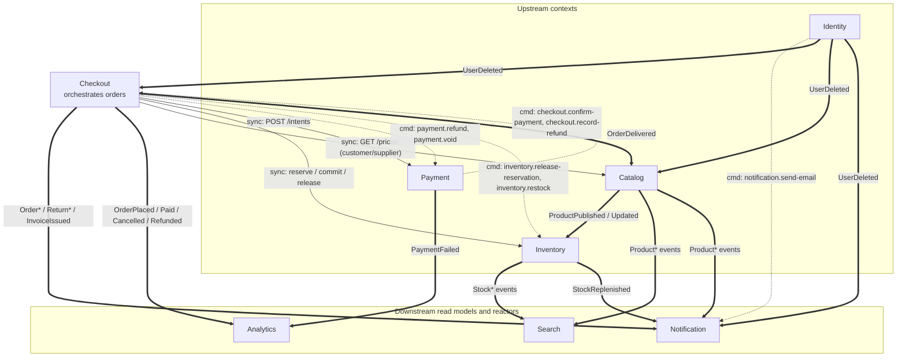
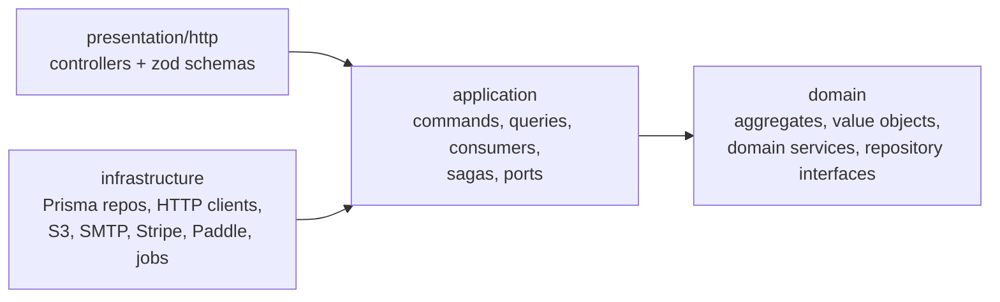
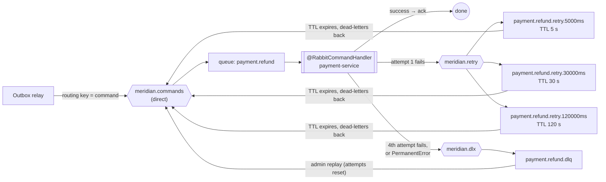
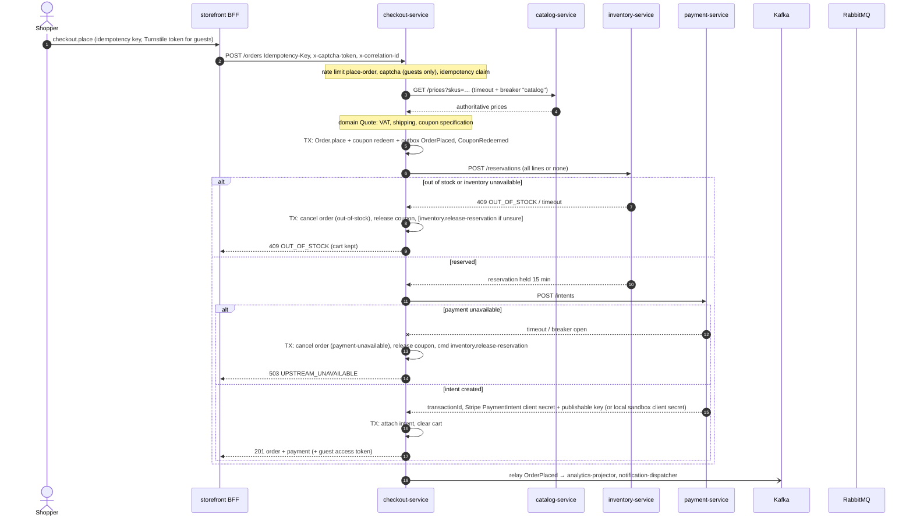
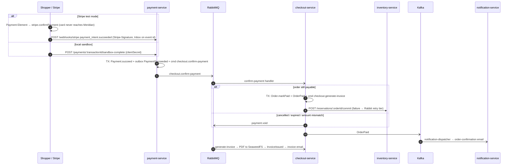
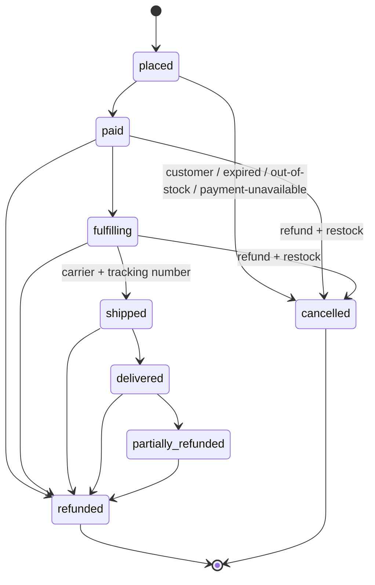
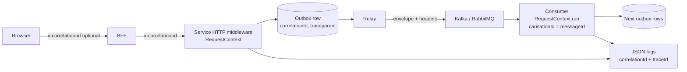

# Meridian architecture

This document describes the system as it is implemented. Where the code and the original plan differ, the code wins, and the difference is noted under [Known limitations and trade-offs](#known-limitations-and-trade-offs).

Contents:

1. [Goals and constraints](#goals-and-constraints)
2. [Bounded contexts and the context map](#bounded-contexts-and-the-context-map)
3. [Inside a service: clean architecture and CQRS](#inside-a-service-clean-architecture-and-cqrs)
4. [Messaging](#messaging)
5. [The place-order saga](#the-place-order-saga)
6. [Payment confirmation, cancellation, refunds and returns](#payment-confirmation-cancellation-refunds-and-returns)
7. [Services in detail](#services-in-detail)
8. [The storefront BFF](#the-storefront-bff)
9. [Resilience](#resilience)
10. [Observability](#observability)
11. [Chaos controls and the System page](#chaos-controls-and-the-system-page)
12. [Security notes](#security-notes)
13. [Testing strategy](#testing-strategy)
14. [Known limitations and trade-offs](#known-limitations-and-trade-offs)

---

## Goals and constraints

Meridian is a demo shop. Its purpose is to show, in code you can run, how to split a commerce domain into bounded contexts and keep them consistent without distributed transactions. The owner set these rules, and the code enforces them:

- **Payments are test mode only.** Stripe in test mode is the live provider (PaymentIntents + the Payment Element, signed webhooks), and payment-service refuses to start with a live Stripe key. The local sandbox provider is the fallback when no Stripe keys are set. A Paddle sandbox adapter is kept as a second, inactive adapter (Paddle does not allow physical goods), with its own sandbox-only guard.
- **Email is sandbox only.** SMTP must point at Mailhog or another local catcher, or the notification service will not start.
- **Captcha is Cloudflare Turnstile** with the official test keys by default. Verification is a real HTTP call with a timeout and a circuit breaker, and it **fails closed**.
- **Search is a Postgres read model** (`tsvector`, `pg_trgm`, facets) maintained by a Kafka consumer group. There is no OpenSearch.
- **Rate limiting is Redis-backed**, so every replica shares the same counters.
- Kafka, RabbitMQ, dead letters, consumer groups, correlation ids, graceful shutdown, timeouts and circuit breakers are each **used by a real feature** and can be shown live.

---

## Bounded contexts and the context map

Eight NestJS services and one Next.js app. Each service owns one Postgres schema, and no service reads another service's tables.

| Context | Service | Port | Schema | Kafka topic it owns | What it owns |
|---|---|---|---|---|---|
| Identity | `identity-service` | 3001 | `identity` | `meridian.identity` | Users, credentials, sessions, addresses, one-time tokens |
| Catalog | `catalog-service` | 3012 | `catalog` | `meridian.catalog` | Products, variants, images, reviews, wishlists, purchase records |
| Inventory | `inventory-service` | 3003 | `inventory` | `meridian.inventory` | Stock levels, reservations, stock movements |
| Checkout | `checkout-service` | 3004 | `checkout` | `meridian.checkout` | Carts, pricing, coupons, orders, returns, refunds, invoices |
| Payment | `payment-service` | 3005 | `payment` | `meridian.payment` | Payments, provider transactions, provider refunds |
| Notification | `notification-service` | 3006 | `notification` | `meridian.notification` | Email deliveries, newsletter subscriptions, contact messages, stock alerts |
| Search | `search-worker` | 3007 | `search` | none (read model only) | Search documents and facets |
| Analytics | `analytics-service` | 3008 | `analytics` | none (read model only) | Sales projections |
| Storefront | `storefront` | 3100 | none | none | UI and the tRPC BFF |

Topic names, consumer groups, event names, command names and every REST DTO live in one package, `packages/contracts/src`. It is the published language between contexts. Services depend on contracts, never on each other's code.

### Context map



Legend: solid arrows are synchronous REST, dotted arrows are RabbitMQ commands, thick arrows are Kafka events.

The relationships are deliberate:

- **Checkout is the orchestrator.** It is the only context that coordinates others while a shopper waits. It calls catalog for authoritative prices (it never trusts prices from the browser), inventory for all-or-nothing reservations, and payment for an intent.
- **Catalog, inventory and payment do not know checkout exists.** They expose APIs and receive commands. That keeps them reusable, for example by an admin tool or a future marketplace.
- **Search, analytics and notification are pure downstream.** They only consume events, so they can be rebuilt, scaled or be down without blocking a purchase.
- **Identity deletion is choreographed, not orchestrated.** Identity publishes `UserDeleted` and forgets the user. Checkout anonymises orders, catalog anonymises reviews and deletes wishlists, and notification drops newsletter subscriptions and stock alerts, each in its own consumer group.

---

## Inside a service: clean architecture and CQRS

Every service has the same four layers under `src/`, and dependencies point inwards:



| Layer | May import | Must not import |
|---|---|---|
| `domain/` | `@meridian/kernel`, contract types, other domain files | Nest, Prisma, HTTP, brokers |
| `application/` | domain, ports it defines, `@nestjs/cqrs`, messaging decorators | Prisma, concrete HTTP clients, controllers |
| `infrastructure/` | application ports, Prisma, SDKs | controllers |
| `presentation/http/` | `CommandBus`, `QueryBus`, zod | repositories, Prisma |

Why this matters in practice:

- **Domain rules are unit-tested without a database.** For example, `apps/checkout-service/src/domain/order/order-status.ts` holds the order state machine, and `apps/inventory-service/src/domain/stock/stock-item.ts` guarantees `0 <= reserved <= onHand`. Tests run in milliseconds with in-memory fakes.
- **Adapters are swappable behind ports.** Payment's `PaymentProvider` port (`apps/payment-service/src/application/ports/payment-provider.ts`) has Stripe test-mode, local sandbox and Paddle sandbox implementations, and the application layer does not know which is active.
- **Unit of work.** A command handler loads an aggregate, calls a domain method, then saves the aggregate and writes its domain events to the outbox **in one Prisma transaction**.

The shared building blocks are in `packages/kernel/src`: `Money` in integer cents, `Email`, `AggregateRoot` / `DomainEvent`, the `DomainError` family with `ensure`, and a `Clock` abstraction so tests can use a `FixedClock`.

### CQRS

- **Every write endpoint dispatches a command** through `@nestjs/cqrs` `CommandBus`, and every read endpoint dispatches a query through `QueryBus`. Controllers contain no business logic.
- **Reads that span contexts use dedicated read models,** so no query joins across services:
  - **Search** (`search-worker`) keeps product documents and per-SKU availability, built from catalog and inventory events.
  - **Analytics** (`analytics-service`) keeps daily sales, product sales and cancellation stats, built from order and payment events.
  - **Purchase records** in catalog are built from `OrderDelivered` and decide who may write a review.
  - **Notification's order recipients and product directory** are built from `OrderPlaced` and product events, so emails can show an address and a product name without calling other services.
- **Within a service,** list queries such as admin orders read denormalised columns directly. A separate read store there would add latency and moving parts without buying anything.

Read models are disposable. Search and analytics both have an admin **rebuild** that truncates the tables and replays the Kafka log from the beginning (see [Search](#search-worker) and [Analytics](#analytics-service)).

---

## Messaging

All messaging code is in `packages/nest-kit/src/messaging`, so every service behaves the same way.

### Kafka is the domain event log; RabbitMQ carries commands

| | Kafka | RabbitMQ |
|---|---|---|
| Carries | **Events**: facts about the past (`OrderPaid`) | **Commands**: work to do once (`payment.refund`) |
| Addressing | One topic per bounded context, 3 partitions, key = aggregate id | Direct exchange `meridian.commands`, routing key = queue = command name |
| Consumers | Many **consumer groups**, each with its own offsets | Exactly one owning service per queue (`CommandOwner` in contracts) |
| Ordering | Per aggregate (same key → same partition) | None needed; each command is independent |
| Retry | In-process backoff `KAFKA_RETRY_DELAYS_MS` = 500, 2000, 5000 ms | TTL retry queues `RABBIT_RETRY_DELAYS_MS` = 5 s, 30 s, 120 s |
| Poison messages | Group's **dead-letter topic (DLT)** `meridian.dlt.<group>` | **Dead-letter queue (DLQ)** `<queue>.dlq` via exchange `meridian.dlx` |
| Replay | To `meridian.replay.<group>`, which only that group reads | Republished to the command queue with attempts reset |
| Why | Replayable history, many independent readers, rebuildable read models | Per-message ack, retry tiers, a DLQ an operator can inspect |

Using both is a conscious trade-off. Kafka alone would need retry and DLQ tooling built around topics for commands. RabbitMQ alone cannot replay history to rebuild a read model. Each broker does the job it is good at.

### Transactional outbox

A service never publishes directly inside a request. `OutboxWriter` (`packages/nest-kit/src/messaging/outbox-writer.ts`) inserts a row into the service's own `Outbox` table **in the same transaction** as the aggregate change. The row stores the correlation id, the causation id and the W3C `traceparent`.

`OutboxRelay` (`packages/nest-kit/src/messaging/relay.ts`) polls every `OUTBOX_POLL_MS` (default 500 ms):

1. `SELECT … FROM "Outbox" WHERE "publishedAt" IS NULL ORDER BY "createdAt" LIMIT 100 FOR UPDATE SKIP LOCKED`. `SKIP LOCKED` lets several replicas relay in parallel without taking the same row.
2. Events go to the Kafka topic of their bounded context, keyed by aggregate id. Commands go to RabbitMQ with publisher confirms and `mandatory: true`. Before publishing a command, the relay declares its durable queue, retry queues and DLQ, so **a command is never lost while its consumer is offline**.
3. On success it sets `publishedAt`. On failure it increments `attempts`, stores `lastError` and backs the row off exponentially (1 s, 2 s, 4 s … capped at 30 s). Later events **of the same aggregate** wait behind a failed one, so per-aggregate order is kept.
4. It runs inside the stored trace context, so a trace continues from the HTTP request through the relay into the consumer.

This gives **at-least-once publication with no dual-write gap.** If the database commit fails, nothing is published. If the broker is down, rows wait.

### Inbox and idempotent consumers

At-least-once delivery means duplicates. `Inbox.once(tx, consumer, messageId, work)` (`packages/nest-kit/src/messaging/inbox.ts`) inserts `(messageId, consumer)` with `ON CONFLICT DO NOTHING` and runs `work` only if the insert happened, **in the same transaction** as the side effects. A redelivered message is then a no-op. Some handlers use natural keys instead, for example one `OrderRefunded` per `refundId`, one invoice per order, or `EmailDelivery.dedupeKey`.

### Kafka consumer groups

`@KafkaEventHandler({ group, events })` (`packages/nest-kit/src/messaging/kafka.ts`) creates one kafkajs consumer per group. The consumer subscribes to the topics of those events plus the group's replay topic. It processes partitions concurrently (3 at a time), which keeps per-key order, and **commits an offset only after the handler succeeds or the record has been written to the DLT.**

The six consumer groups, as named in `ConsumerGroups` in `packages/contracts/src/messaging.ts`:

| Consumer group | Service | Events consumed | Purpose |
|---|---|---|---|
| `search-indexer` | search-worker | `ProductPublished`, `ProductUpdated`, `ProductArchived`, `StockReserved`, `StockReservationReleased`, `StockCommitted`, `StockAdjusted`, `StockDepleted`, `StockReplenished` | Search documents and availability |
| `analytics-projector` | analytics-service | `OrderPlaced`, `OrderPaid`, `OrderCancelled`, `OrderRefunded`, `PaymentFailed` | Sales projections |
| `notification-dispatcher` | notification-service | `OrderPlaced`, `OrderPaid`, `OrderShipped`, `OrderDelivered`, `OrderCancelled`, `OrderRefunded`, `ReturnRequested`, `ReturnApproved`, `ReturnRejected`, `InvoiceIssued`, `StockReplenished`, `ProductPublished`, `ProductUpdated`, `ProductArchived`, `UserDeleted` | Lifecycle emails, back-in-stock alerts, product name directory, forgetting deleted users |
| `catalog-purchases` | catalog-service | `OrderDelivered`, `UserDeleted` | Verified-purchase records for reviews; anonymise reviews |
| `checkout-identity` | checkout-service | `UserDeleted` | Anonymise orders, delete the cart |
| `inventory-catalog-sync` | inventory-service | `ProductPublished`, `ProductUpdated` | Create a stock row (`DEFAULT_STOCK_ON_HAND`, default 8) for every new SKU |

Two points to note:

- **Several groups read the same topic independently.** `meridian.catalog` is read by `search-indexer`, `inventory-catalog-sync` and `notification-dispatcher`. If one group is failing and parking events on its DLT, the others keep consuming (`tests/system/specs/07-kafka-dlt.test.ts`).
- **Scaling works within a group.** Start a second `search-worker` and the group rebalances, the two members split the 3 partitions, and each event is handled by exactly one of them (`tests/system/specs/08-consumer-scaling.test.ts`).

### RabbitMQ commands, retry tiers and the DLQ

The eight commands (`packages/contracts/src/commands.ts`) and their owners:

| Command | Owner | Sent by |
|---|---|---|
| `notification.send-email` | notification-service | identity (account emails), notification itself (order, newsletter, contact, stock emails) |
| `checkout.confirm-payment` | checkout-service | payment-service after a successful payment |
| `checkout.record-refund` | checkout-service | payment-service after a refund succeeds or is rejected |
| `checkout.generate-invoice` | checkout-service | checkout-service after an order is paid |
| `payment.refund` | payment-service | checkout-service (admin refund, paid cancellation, approved return) |
| `payment.void` | payment-service | checkout-service (an unpaid order was cancelled or expired, or payment arrived for an order that is no longer payable); payment-service itself |
| `inventory.release-reservation` | inventory-service | checkout-service (unpaid cancellation, expiry, saga compensation) |
| `inventory.restock` | inventory-service | checkout-service (paid cancellation, approved return with restock) |



How it works (`packages/nest-kit/src/messaging/rabbit-processor.ts`, `packages/nest-kit/src/messaging/retry.ts`):

- The handler runs inside the message's correlation id and trace context. The message is **acked only after the handler settles.**
- On an ordinary error, the consumer publishes a copy with an incremented `x-attempts` header to the next retry queue, then acks the original. The retry queue has no consumer. Its message TTL dead-letters the copy back to `meridian.commands` after the delay. With the default tiers a command is delivered **at most 4 times** over about 2.5 minutes.
- A `PermanentError` skips the tiers and goes straight to the DLQ. Handlers throw it for errors that retrying cannot fix: invalid payloads, `NOT_FOUND`, `INVALID_TRANSITION`.
- Handlers see `meta.attempt` and `meta.maxAttempts`. The email handler uses this to mark the `EmailDelivery` row **dead-lettered** and emit `EmailDeadLettered` on the final attempt.

**Why TTL retry queues instead of `nack` with requeue?** A requeue retries immediately, in a tight loop, while the dependency is still down. Tiered delays give SMTP or a payment provider time to recover, and they need no broker plugin.

### Dead letters and replay

Every service with messaging exposes the same admin API (`packages/nest-kit/src/messaging/admin.ts`, AdminOnly):

- `GET /admin/messaging`: outbox backlog (pending, oldest, failing), each command queue with ready, consumers and DLQ depth, and each consumer group with state, members, lag and DLT depth.
- `GET /admin/messaging/dead-letters?source&queueOrTopic&limit`: peek at parked messages with attempts, last error and correlation id.
- `POST /admin/messaging/replay` `{ source, queueOrTopic, ids?, limit? }`.

Replay semantics differ by broker:

- **RabbitMQ:** messages are taken off the DLQ and republished to the command queue with attempts reset.
- **Kafka:** a topic is an immutable log, so the DLT record is **copied** to `meridian.replay.<group>`, and the replay is recorded in the Inbox under `dlt-replay:<topic>`. The copy and the Inbox mark share one transaction, so a record is never replayed twice even if two admins click at once. **Only the failed group subscribes to its replay topic,** so the groups that had already handled the event never see it a second time.

The System page puts a UI on this API (see [Chaos controls and the System page](#chaos-controls-and-the-system-page)).

### Message envelope and headers

Every message is a `MessageEnvelope` (`packages/contracts/src/messaging.ts`): `messageId` (= outbox row id, the dedupe key), `kind`, `name`, `version`, `occurredAt`, `producer`, `correlationId`, `causationId`, `aggregateType`, `aggregateId`, `payload`. The broker headers repeat the ids (`x-correlation-id`, `x-message-id`, `x-causation-id`, `traceparent`) and add failure metadata (`x-attempts`, `x-last-error`, `x-original-topic`, `x-consumer-group`, `x-first-failed-at`).

**No secrets travel on Kafka.** Guest order links in emails use `orderAccessToken(orderId)`, an HMAC of the order id with `ORDER_LINK_SECRET`, which the notification service recomputes itself. One-time tokens for verify-email and password-reset links do travel inside `notification.send-email` commands on RabbitMQ (see Known limitations).

`MESSAGING_NAMESPACE`, when set, prefixes every topic, group, exchange and queue. Tests and the system suite use it to share brokers with the dev stack without interfering.

---

## The place-order saga

Placing an order touches four contexts and has no distributed transaction. It is an **orchestrated saga** in `apps/checkout-service/src/application/sagas/place-order.saga.ts`, with explicit compensation.



Design notes:

- **The order is written before any remote call.** If the process dies half-way, a `placed` order with a `paymentDeadline` exists, and the expiry sweep (`ORDER_EXPIRY_SWEEP_MS`, holds of `ORDER_HOLD_MINUTES`, default 15) cancels it and sends `inventory.release-reservation`. Inventory also expires stale holds on its own (`RESERVATION_SWEEP_MS`, `RESERVATION_HOLD_SECONDS` + `RESERVATION_GRACE_SECONDS`) as a second safety net.
- **Reservation is all-or-nothing.** Inventory locks stock rows in ascending SKU order, which prevents deadlocks between concurrent orders, and takes a per-order advisory lock. It is idempotent per order id.
- **Compensation is precise.** A definite `OUT_OF_STOCK` means nothing was reserved, so no release is sent. A timeout means the reservation may exist, so a release command is sent. A failed intent always releases.
- **Idempotency.** `POST /orders` requires an `Idempotency-Key`. Checkout stores claims in Postgres, so a double-click or a retried request returns the first result, and a different body under the same key returns `IDEMPOTENCY_MISMATCH`. Upstream calls carry their own keys: `reserve-<orderId>`, `intent-<orderId>` and `commit-<orderId>`.
- **Prices come from catalog, never from the browser.** Tax is VAT-inclusive at the destination rate (`TaxPolicy`). Shipping is standard €49 (free from €1000 after discount), express €99, white-glove €149 or collect €0 (`ShippingPolicy`).

Tested by `tests/system/specs/01-purchase.test.ts` and `tests/system/specs/02-compensation.test.ts`, and for the breaker path by `tests/system/specs/10-circuit-breaker.test.ts`.

---

## Payment confirmation, cancellation, refunds and returns

### Payment confirmation is asynchronous



The shopper's order page polls every 2 seconds, for up to 60 seconds, until the status is `paid`. **Why a command and not "checkout listens to PaymentSucceeded"?** Confirmation is work that checkout must do exactly once, with retries and a DLQ if it keeps failing. It is not optional downstream reaction. The event still exists for analytics and auditing.

A late payment for a cancelled order is not lost. Checkout sends `payment.void`, and payment records a full refund.

### Order state machine

`apps/checkout-service/src/domain/order/order-status.ts`:



A partial refund before delivery does not change the fulfilment status. It raises `refundedCents`. `partially_refunded` applies only after delivery (amendment 1o).

### Cancellation

`apps/checkout-service/src/application/commands/cancel-order.handler.ts`:

- **Placed (unpaid):** cancel, release the coupon redemption, send `inventory.release-reservation`.
- **Paid or fulfilling:** cancel with `refundRequired`, send `payment.refund` for the full refundable amount, and send `inventory.restock` with every line. Stock was already committed at payment, so it must be restocked, not released.
- **Shipped or later:** `409 ORDER_NOT_CANCELLABLE`. Use a return instead.

### Refunds

```mermaid
sequenceDiagram
  autonumber
  actor Admin
  participant CO as checkout-service
  participant R as RabbitMQ
  participant PAY as payment-service
  participant K as Kafka

  Admin->>CO: POST /admin/orders/:id/refunds {amountCents, reason}
  Note over CO: amount must be positive and at most paid − refunded − pending, else 400
  CO->>CO: TX: pending Refund + cmd payment.refund + audit row
  CO-->>Admin: 202 Accepted
  R-)PAY: payment.refund
  PAY->>PAY: provider.refund (Stripe: refunds.create, usually immediate, pending ones settle on refund.updated; local: immediate)
  alt provider accepted
    PAY->>PAY: TX: PaymentRefunded + cmd checkout.record-refund {succeeded}
  else provider rejected
    PAY->>PAY: TX: RefundFailed + cmd checkout.record-refund {failed}
  else transient error
    PAY--)R: retry tier → … → DLQ
  end
  R-)CO: checkout.record-refund (idempotent per refundId)
  CO->>CO: refundedCents, status refunded / partially_refunded, OrderRefunded
  CO-)K: OrderRefunded → notification (order-refunded email), analytics (net revenue)
```

Refunds are **asynchronous and visible**. The admin sees a pending refund at once, a failed refund stays listed as failed, and money is never recorded as returned until the provider confirms it.

### Returns

1. The shopper requests a return from the order page: `POST /orders/:id/returns` with lines and a reason. It is allowed only for delivered or partially refunded orders, within 30 days, and for quantities up to purchased minus open or approved returns. Checkout emits `ReturnRequested`, and the dispatcher sends a return-received email.
2. The admin decides in the returns queue: `POST /admin/returns/:id/decision`.
   - **Approve:** `ReturnApproved`, `payment.refund` for the refund amount (default = returned line totals with the order discount pro-rated), and `inventory.restock` when restock is ticked. The return becomes `refunded` when `checkout.record-refund` succeeds.
   - **Reject:** `ReturnRejected` with a note, which sends an email. There is no refund and no restock.

Covered by `tests/system/specs/03-refunds.test.ts`, `tests/system/specs/04-returns.test.ts` and `tests/system/specs/05-cancel.test.ts`.

---

## Services in detail

Each section lists aggregates and their invariants, the main commands and queries, and the messages the service consumes and publishes. Error codes come from `ErrorCodes` in contracts and map to HTTP statuses in one place (the kit's exception filter).

### identity-service

- **Aggregates**
  - `User` (`apps/identity-service/src/domain/user/user.ts`):
    - Email is normalised and unique regardless of case.
    - At most 10 addresses and exactly one default. The first address becomes the default, and removing the default promotes the oldest remaining one.
    - A deleted user cannot change.
    - `UserProfileUpdated` is raised only when the name actually changes.
  - `OneTimeToken` (`domain/token/one-time-token.ts`): verify-email tokens last 24 h and password-reset tokens 1 h. Only a SHA-256 hash is stored, each token works once, and issuing a new link invalidates older ones. Errors are `TOKEN_INVALID` and `TOKEN_EXPIRED`.
  - `RefreshToken` with `RefreshTokenRotation`: 30-day tokens in families. Reusing a rotated token revokes the whole family.
  - Value objects: `PlainPassword` (8–256 characters, never serialised), `UserName`, `Role`, and `Address` (ISO country code, field length limits).
- **Commands:** RegisterUser, Login, RefreshSession, Logout, VerifyEmail, ResendVerification, RequestPasswordReset, ResetPassword, ChangePassword, UpdateProfile, AddAddress, UpdateAddress, RemoveAddress, DeleteAccount, SeedAdmin.
- **Queries:** GetCurrentUser, ListAddresses, ListCustomers.
- **Publishes**
  - Events: `UserRegistered`, `UserEmailVerified`, `UserProfileUpdated`, `UserDeleted`.
  - Command: `notification.send-email` with templates verify-email, password-reset, password-changed and account-deleted.
- **Consumes:** nothing. Identity is purely upstream.
- **Security details**
  - Passwords are hashed with Argon2.
  - Login is constant-time: a decoy hash is checked for unknown emails, and there is one error message for both failure cases.
  - A wrong current password on `POST /me/password` or `DELETE /me` returns **403, not 401**. The BFF treats 401 as an expired session, which would sign the shopper out.
  - `DELETE /me` is rate limited so that a stolen access token cannot be used to guess the password (amendment 1i).

### catalog-service

- **Aggregates**
  - `Product` (`apps/catalog-service/src/domain/product/product.ts`):
    - Lifecycle is draft → published ⇄ archived.
    - Publishing needs at least one variant (409 otherwise), and the slug is frozen once published.
    - Price is 0 < cents ≤ 100,000,000. There are at most 20 images and 20 materials.
    - A SKU used by another product is a 409 (`sku-policy.ts`).
    - `ProductUpdated` is raised only while the product is published.
  - `ProductVariant` value object: SKU format, 1–20 variants per product, unique ids and SKUs.
  - `ProductImage`: JPEG, PNG or WebP. The object key must be `products/<id>/…`. The 8 MB cap is checked at attach time from the stored object's metadata.
  - `Review` (`domain/review/review.ts`):
    - Rating 1–5, title up to 120 characters, body 20–2000.
    - One review per user per product.
    - Allowed only with a **purchase record**, which is created when an order containing the product is delivered (`review-eligibility.ts`).
    - `anonymise()` sets the author to "Former customer".
  - `Wishlist`: at most 100 slugs, no duplicates.
- **Commands:** CreateProduct, UpdateProduct, ReplaceVariants, PublishProduct, ArchiveProduct, CreateImageUpload, AttachProductImage, RemoveProductImage, PostReview, ReplaceWishlist, AddToWishlist, RemoveFromWishlist, RecordPurchases, ForgetUser, SeedCatalog.
- **Queries:** GetCatalogSnapshot, ListCategories, ListMaterials, ListProducts, GetProduct, GetPrices (service-only, used by checkout), AdminListProducts, AdminGetProduct, ListReviews, GetReviewEligibility, GetWishlist.
- **Publishes:** `ProductPublished`, `ProductUpdated` (full snapshot plus the changed fields), `ProductArchived`, `ReviewPosted`. All are keyed by product id, and the seed never republishes an unchanged product.
- **Consumes:** group `catalog-purchases`: `OrderDelivered` → RecordPurchases (guest orders skipped); `UserDeleted` → ForgetUser (anonymise reviews, delete the wishlist and purchase records).
- **Infrastructure**
  - **Snapshot cache:** the catalog snapshot is cached in Redis cache-aside for 60 s, with a generation counter bumped on every write. If Redis fails, reads fall back to the database.
  - **Image uploads** go to SeaweedFS: presigned PUT for 5 minutes, then attach verifies the object with a HEAD request.
  - **S3 calls:** timeout `S3_TIMEOUT_MS` (default 5000), breaker `s3`, chaos target `s3.put`.

### inventory-service

- **Aggregates**
  - `StockItem` (`apps/inventory-service/src/domain/stock/stock-item.ts`):
    - `0 ≤ reserved ≤ onHand`.
    - Reserving more than is available throws `OUT_OF_STOCK` with `{sku, available}`.
    - An adjustment needs a reason and may not go below the reserved quantity.
    - When available crosses zero it raises `StockDepleted` or `StockReplenished`.
  - `Reservation` (`domain/reservation/reservation.ts`): held → committed or released, and both end states are final. Repeating the same transition is a no-op, and the opposite one is `INVALID_TRANSITION`.
  - `StockAllocator` domain service: checks every line before touching any, which makes a reservation all-or-nothing.
- **Commands:** ReserveStock, CommitReservation, ReleaseReservation, ExpireReservations, RestockItems, AdjustStock, SeedStock, SyncCatalogStock.
- **Queries:** ListPublicStock, GetPublicStock, ListAdminStock, ListStockMovements.
- **Publishes:** `StockReserved`, `StockReservationReleased`, `StockCommitted`, `StockAdjusted`, `StockDepleted`, `StockReplenished`.
- **Consumes**
  - Kafka group `inventory-catalog-sync`: `ProductPublished` and `ProductUpdated` create missing stock rows and never overwrite existing ones.
  - Rabbit commands: `inventory.release-reservation`, and `inventory.restock`, which is idempotent per return or order through two Inbox keys.
- **Concurrency**
  - A per-order advisory lock, then `SELECT … FOR UPDATE` on stock rows in ascending SKU order.
  - The expiry job runs every `RESERVATION_SWEEP_MS` and never overlaps itself.

### checkout-service

- **Aggregates**
  - `Order` (`apps/checkout-service/src/domain/order/order.ts`), with `ReturnRequest` and `Refund` inside it:
    - The state machine above.
    - Pricing must add up: total = subtotal − discount + shipping, and every line total = unit × quantity.
    - Order numbers are `M-` plus 8 base32 characters.
    - Shipping requires a carrier and a tracking number.
    - Refund amount must satisfy 0 < amount ≤ paid − refunded − pending.
    - Returns: 30-day window, quantity limits.
  - `Cart` (`domain/cart/cart.ts`): up to 50 lines, one line per SKU, quantity 1–20. Merging on sign-in adds quantities up to the cap.
  - `Coupon` (`domain/coupon/coupon.ts`) and `CouponSpecification`:
    - Types are percent (1–100) or fixed.
    - Checks run in a fixed order: `COUPON_INVALID` (inactive or not started), `COUPON_EXPIRED`, `COUPON_MIN_BASKET`, `COUPON_EXHAUSTED`, `COUPON_ALREADY_USED` (once per customer).
    - Seeds: `NORTH-10` (10%) and `WELCOME-50` (€50 off from €500, once per customer).
  - `Invoice`: numbers `INV-YYYY-000123` from a Postgres sequence.
  - Policies: `TaxPolicy` (VAT by country, default 20%) and `ShippingPolicy`.
- **Commands:** ReplaceCartItems, MergeCart, ClearCart, PurgeIdleCarts, PlaceOrder, ConfirmOrderPayment, ExpireOrders, CancelOrder, RequestReturn, TransitionOrder, RequestRefund, DecideReturn, RecordRefundOutcome, GenerateInvoice, CreateCoupon, UpdateCoupon, AnonymiseCustomer, SeedCoupons.
- **Queries:** GetCart, QuoteCheckout, ListMyOrders, GetOrder, GetInvoiceLink, ListAdminOrders, GetAdminOrder, ListReturns, ListCoupons.
- **Publishes**
  - Events: `OrderPlaced`, `OrderPaid`, `OrderCancelled`, `OrderFulfilling`, `OrderShipped`, `OrderDelivered`, `OrderRefunded`, `ReturnRequested`, `ReturnApproved`, `ReturnRejected`, `CouponRedeemed`, `InvoiceIssued`.
  - Commands: `payment.refund`, `payment.void`, `inventory.release-reservation`, `inventory.restock`, `checkout.generate-invoice`.
- **Consumes**
  - Rabbit: `checkout.confirm-payment`, `checkout.record-refund`, `checkout.generate-invoice` (`apps/checkout-service/src/application/event-handlers`).
  - Kafka group `checkout-identity`: `UserDeleted` sets the customer name to "Deleted customer", the email to `deleted-<userId>@anonymised.invalid` and the phone to null.
- **Upstream HTTP clients** (`apps/checkout-service/src/infrastructure/http/upstream-clients.ts`), each with its own breaker:

  | Client | Default timeout | Retries |
  |---|---|---|
  | `catalog` | 3000 ms | 1 (GET only) |
  | `inventory` | 4000 ms | none |
  | `payment` | 6000 ms | none |
  | `payment-summary` | `PAYMENT_SUMMARY_TIMEOUT_MS`, 2000 ms | none |

  - The admin order detail shows `payment: null` instead of failing when payment-service is down.
- **Admin:** every mutation (transitions, refunds, return decisions, coupon changes) writes an audit row with the admin's id, and the order timeline records each step.

### payment-service

- **Aggregate:** `Payment` (`apps/payment-service/src/domain/payment/payment.ts`), with refunds inside it.
  - Status is pending → succeeded, failed or voided. Succeeding a payment that is not pending throws `ORDER_NOT_PAYABLE`. A capture on a closed payment voids it and records a full refund.
  - Each refund id is applied once. Amounts above the refundable balance are recorded as failed refunds with `RefundFailed`.
  - A dispatch lease stops two workers from refunding at once.
- **Commands:** CreatePaymentIntent, CompleteSandboxPayment, HandleStripeWebhook, HandlePaddleWebhook, RefundPayment, VoidPayment.
- **Query:** GetPaymentByOrder.
- **Publishes**
  - Events: `PaymentSucceeded`, `PaymentFailed`, `PaymentVoided`, `PaymentRefunded`, `RefundFailed`.
  - Commands: `checkout.confirm-payment`, `checkout.record-refund`, and `payment.void` to itself.
- **Consumes:** Rabbit `payment.refund` and `payment.void`.
- **Providers,** behind the `PaymentProvider` port. `PAYMENT_PROVIDER` (`stripe` | `paddle` | `local`) picks the one that takes new intents; unset means Stripe if `STRIPE_SECRET_KEY` is set, else Paddle if configured, else local. Every configured provider stays available for refunds and webhooks of its own payments.
  - `StripeTestProvider` (`infrastructure/providers/stripe-test.provider.ts`) is the live provider.
    - One `new Stripe(key, { apiVersion: "2026-08-26.dahlia" })` client instance; test keys only (`sk_test_`/`rk_test_`, `pk_test_`), checked by `loadPaymentConfig` at startup and again in the constructor.
    - `createTransaction` creates a PaymentIntent in EUR cents with `metadata {paymentId, orderId, orderNumber}`, a description and `receipt_email`, idempotency key `meridian-intent-<paymentId>`. `payment_method_types` is never sent: the Dashboard's dynamic payment methods decide. The intent DTO carries `stripe {clientSecret, publishableKey}`; a replay fetches the client secret of the stored PaymentIntent.
    - Refunds call `refunds.create` (partial with `amount`, full without), idempotency key from the refundId; `succeeded` settles at once, `pending` settles on `refund.updated` / `charge.refund.updated`. Void calls `paymentIntents.cancel` and ignores an already terminal PaymentIntent.
    - Calls go through breaker `stripe` (chaos target `stripe.api`) with a 10 s SDK timeout and one SDK retry. Stripe 4xx answers (`StripeInvalidRequestError`, card errors, other than 408/429) become `ProviderRejectedError` and do not trip the breaker.
    - `sandbox-complete` also works for Stripe payments (test mode only, same client secret check): it confirms the PaymentIntent server side with `pm_card_visa`, and the webhook settles it. Tests and scripts use it to pay without a browser.
    - `POST /webhooks/stripe` (`HandleStripeWebhookHandler`): `payment_intent.succeeded` captures (or refunds a late capture of a closed payment), `payment_intent.payment_failed` records the attempt but keeps the payment pending so the Payment Element can retry, `payment_intent.canceled` fails it, `refund.*` / `charge.refund.updated` settle pending refunds (matched by Stripe refund id, or by the refundId in its metadata when the event arrives first).
  - `LocalSandboxProvider` is the fallback when no Stripe keys are set. It makes no external calls.
    - A client secret (`pcs_` + HMAC of the payment id) is returned once; only its SHA-256 hash is stored.
    - `POST /payments/:transactionId/sandbox-complete` requires that secret: a wrong secret is 403, and the route is 404 when neither the local sandbox nor Stripe test mode is active.
    - Refunds succeed immediately.
  - `PaddleSandboxProvider` is retained but not active by default (Paddle's terms exclude physical goods). It is selected with `PAYMENT_PROVIDER=paddle`, or when `PADDLE_API_KEY` is set and Stripe is not.
    - The base URL is fixed to `https://sandbox-api.paddle.com`. `PADDLE_API_BASE_URL` is honoured only when `NODE_ENV=test`, for stubs.
    - Calls have a 5000 ms timeout, breaker `paddle` and chaos target `paddle.api`. A Paddle 4xx (other than 408/429) is a rejection and does not trip the breaker.
    - Refunds use the adjustments API and settle when the `adjustment.updated` webhook arrives.
  - Webhook verification details are under [Security notes](#security-notes).

### notification-service

- **Aggregates**
  - `EmailDelivery` (`apps/notification-service/src/domain/delivery/email-delivery.ts`):
    - Statuses are queued, sent, failed, dead-lettered and suppressed.
    - `dedupeKey` is unique, so a duplicate command never sends twice.
    - Each attempt is recorded. On the final broker attempt a failure becomes `dead-lettered` plus `EmailDeadLettered`. A replay that then succeeds marks it `sent`.
    - Recipients on `.invalid`, `.example` and `.localhost` domains are `suppressed`; anonymised customers use these domains (amendment 1m).
  - `NewsletterSubscription`: pending → confirmed → unsubscribed. Double opt-in with a 48 h single-use token, stored hashed.
  - `StockAlert`: one pending alert per email and SKU; notified once.
  - `ContactMessage`: immutable, with topic and length rules.
  - Read models: `OrderRecipient` (from `OrderPlaced`) and `ProductDirectory` (slug → name and image, from product events).
- **Commands:** SendEmail, SubscribeNewsletter, ConfirmNewsletter, UnsubscribeNewsletter, SubmitContactMessage, CreateStockAlert, NotifyStockAlerts, ProjectProduct, RecordOrderRecipient, DispatchOrderEmail, ForgetCustomer.
- **Queries:** ListEmailDeliveries, ListContactMessages.
- **Publishes:** `EmailSent`, `EmailDeadLettered`, plus `notification.send-email` commands for every email it decides to send.
- **Consumes**
  - Rabbit `notification.send-email` (prefetch 10). It is **the only code path that sends mail.**
  - Kafka group `notification-dispatcher`, with the events listed in the consumer-group table.
- **Adapter:** `SmtpMailer` (`apps/notification-service/src/infrastructure/mail/smtp-mailer.ts`)
  - nodemailer with connection 5 s, greeting 5 s and socket 10 s timeouts, and a 30 s cap on the whole call.
  - Breaker `smtp`, chaos target `smtp.send`.
  - SMTP 550–554 replies are permanent and do not trip the breaker.
  - Every subject is prefixed `[Meridian sandbox]`.

### search-worker

- **Read model:** product documents and per-SKU availability in schema `search`.
  - **Documents** (`apps/search-worker/src/domain/search-document.ts`) are versioned by event time, so an older event never overwrites a newer one and an archived tombstone is replaced only by something newer.
  - **Availability** (`domain/sku-availability.ts`): the latest fact wins, and a product is in stock when any variant is.
- **Search SQL** (`apps/search-worker/src/infrastructure/persistence/search-sql.ts`):
  - `tsvector` with weights A (name, kind), B (materials, variant labels, category) and C (story), ranked with `ts_rank`.
  - **Typo tolerance:** when full-text search finds nothing, it falls back to `pg_trgm` similarity ≥ 0.3 on name and kind and sets `didYouMean` to the closest product name. `pg_trgm` is installed once in schema `public` by the compose `postgres-init` job.
  - **Facets** (category, materials, colours, price, in stock) are counted over the result set, each ignoring its own filter, the way a shop filter sidebar expects.
  - Cursor pagination; suggestions use prefix and word similarity.
- **Commands:** IndexProduct, ArchiveProduct, RecordStockEvent, RebuildSearchIndex, EnsureReadModel.
- **Queries:** SearchProducts, SuggestProducts.
- **Consumes:** group `search-indexer`. **Publishes:** nothing.
- **Rebuild:** `POST /admin/search/rebuild` returns 202, stops the consumer, deletes the group's committed offsets, truncates the tables and restarts, which replays the topics from the beginning. On startup, if the tables are empty but the group already has committed offsets (for example after a schema reset), the service runs the same replay. There is no HTTP dependency on catalog.

### analytics-service

- **Projections** (`apps/analytics-service/src/domain`): daily sales by UTC day, product sales, cancellations by reason, and per-order activity. Each order counts as placed, paid or cancelled at most once, and refunds count only the growth of `totalRefundedCents`. All projections are idempotent per message id through the Inbox.
- **Definitions:**
  - gross = sum of paid order totals
  - net = gross − refunds
  - average order = gross ÷ paid orders
  - conversion = paid ÷ placed
  - top products count only paid lines, aggregated per product
- **Commands:** ProjectOrderFact, RebuildProjections. **Queries:** GetAnalyticsOverview (includes projection lag), GetTopProducts.
- **Consumes:** group `analytics-projector`. **Publishes:** nothing.
- **Projection lag:** committed offsets vs log end offsets, or -1 when Kafka does not answer within 3 s.
- **Rebuild:** `POST /admin/analytics/rebuild` pauses the consumer, waits for the group to be empty, deletes the group offsets, truncates the read model and Inbox, then resumes. It returns 409 if a rebuild is already running or other replicas are still consuming. `tests/system/specs/15-analytics-rebuild.test.ts` shows the totals are identical after a replay.

---

## The storefront BFF

The browser talks only to the Next.js app. Every data call goes to one tRPC endpoint, `/api/trpc`, and the **BFF (backend for frontend)** in `apps/storefront/server` calls the services. Why a BFF?

- **Services are never exposed to the browser.** No CORS, no service JWTs in JavaScript, and one place to apply CSRF rules and redaction.
- **Tokens stay in httpOnly cookies.** JavaScript never sees an access or refresh token.
- **One typed contract to the UI.** tRPC procedures take zod-validated inputs and return contract DTOs.

Key behaviour:

- **Service clients** (`apps/storefront/server/services.ts`)
  - Timeouts: 5000 ms by default, 2500 ms for search and suggest, 15 s for long calls (place order, uploads, rebuilds, dead-letter peek and replay).
  - **Breakers** (`apps/storefront/server/breaker.ts`): one opossum breaker per service, 60 s rolling window, volume threshold 5, 50% errors, reset after `BREAKER_RESET_MS`. An upstream 4xx never counts as a failure. Network errors, timeouts and an open breaker all become `503 UPSTREAM_UNAVAILABLE`.
  - Forwarded headers: `authorization`, `x-correlation-id`, `x-cart-id`, `idempotency-key`, `x-captcha-token`, `x-order-access`, and `x-forwarded-for`, which is sent only when the client IP is not loopback.
- **Correlation id** (`apps/storefront/server/trpc/handler.ts`): the BFF accepts a well-formed `x-correlation-id` or creates a UUID, runs the procedure inside it, and echoes it on the response. Every error sent to the browser carries `correlationId`, and 5xx messages are generic.
- **Session cookies** (`apps/storefront/server/session.ts`, `apps/storefront/server/cookies.ts`)
  - `access` lasts 15 min, `refresh` 30 days, `cart` 30 days, and `oa_<orderId>` (the guest order access token) 30 days.
  - All are httpOnly and `SameSite=Lax`, and `Secure` in production.
  - Refresh rotation is single-flight per token, so parallel requests do not trigger reuse detection.
- **CSRF and abuse:** POSTs are rejected when `sec-fetch-site` is `cross-site` (403), when the body is not JSON (415) or larger than 1 MB (413). The client IP is taken from the right-most `x-forwarded-for` hops, skipping `TRUSTED_PROXY_HOPS`.
- **Admin procedures re-check the role with identity on every call** (`GET /me`), so a demoted admin loses access immediately.
- **Catalog snapshot** (`apps/storefront/server/catalog.ts`): cached in memory for 60 s. When catalog is down, the BFF serves the last good snapshot, so browsing survives a catalog outage.
- **Rendering and caching** (`apps/storefront/server/render-cache.ts`). Catalog pages are server-rendered, so crawlers and first paint see products:
  - **ISR, `revalidate = 60`:** home, `/shop`, `/shop/[category]` (static params from the catalog) and `/product/[slug]` (every published product at build; later ones render on first request). The root layout reads no request data, so content pages are static too. Static routes read upstream data through `unstable_cache` with the tags `storefront:catalog` and `storefront:listings`, because an uncached (`no-store`) service call would turn the route dynamic.
  - **Listings:** `/shop` and `/shop/[category]` render the first search read-model page (hits and facets) on the server and hand it to the client listing as React Query initial data, so hydration makes no second request. Filters, sort and "Load more" run in the browser as before.
  - **Filtered listings are dynamic:** a URL with `colour`, `material`, `min`, `max`, `stock` or `sort` is rewritten (`next.config.ts`, `beforeFiles`) to `/shop-filtered/[[...category]]`, which renders per request. Every filter combination is a different URL, and an ISR page cannot read `searchParams` without becoming dynamic, so these are not worth caching. `/search?q=` also renders its first page per request.
  - **Stock is never in cached HTML.** Product pages load per-SKU availability in the browser (`catalog.stock`, polled every 30 s). JSON-LD `availability` follows the catalog sold-out flag. Listing in-stock badges come from the search read model and can be up to 60 s old.
  - **On-demand revalidation:** admin catalog writes through the BFF (create, update including category and sold-out flag, variants, images, publish, archive) drop the in-memory snapshot, expire both tags and revalidate the whole tree (`revalidatePath("/", "layout")`), because the layout embeds the snapshot. Stock adjustments and search rebuilds revalidate only the listing pages. Search indexes asynchronously, so a listing re-rendered straight after a write can still miss the change until the next 60 s refresh. Revalidation only reaches the Next.js instance that handled the write: other replicas catch up within 60 s unless they share a cache handler.
  - **Upstream down at build:** `generateStaticParams` returns nothing, and pages that cannot load their data render per request instead of failing the build. At runtime, a failed refresh keeps serving the last good page. If only search is down, the listing renders without results and the browser fetches them.
- **System overview** (`apps/storefront/server/system.ts`) fetches `/health`, `/admin/messaging` and `/admin/breakers` from all eight services in parallel, each with its own timeout. One service down never fails the page.

---

## Resilience

### Timeouts on every external call

| Call | Timeout | Where |
|---|---|---|
| BFF → service | 5 s / 2.5 s search / 15 s long | `apps/storefront/server/services.ts` |
| Service → service (REST) | Per client, 2–6 s in checkout | `packages/nest-kit/src/http/resilient-http-client.ts` |
| Turnstile siteverify | `CAPTCHA_TIMEOUT_MS`, default 3000 | `packages/nest-kit/src/security/captcha.ts` |
| SMTP | connect 5 s, greeting 5 s, socket 10 s | notification `SmtpMailer` |
| S3 / SeaweedFS | `S3_TIMEOUT_MS`, default 5000 | catalog media storage, checkout invoice storage |
| Stripe API | `STRIPE_TIMEOUT_MS`, default 10000, one SDK retry | payment `StripeTestProvider` |
| Paddle API | 5000 ms | payment `PaddleSandboxProvider` |
| Redis | command 1000 ms, connect 2000 ms | `packages/nest-kit/src/runtime/redis.service.ts` |
| Kafka | connection 3000 ms, request 10000 ms | kit messaging |
| RabbitMQ | connect 5000 ms, heartbeat 30 s | kit messaging |
| Postgres transactions | max wait 5 s, timeout 15 s (identity, inventory) | Prisma `$transaction` options |

### Circuit breakers

All service-side breakers are created through `createBreaker(name, target, fn, options)` (`packages/nest-kit/src/http/breaker.ts`), which uses opossum with these defaults: volume threshold 5, 50% errors, a 10 s rolling window and `BREAKER_RESET_MS` (default 10 s) before a half-open trial call.

- **Neutral errors** (an upstream 4xx, an SMTP permanent rejection, a Stripe or Paddle validation error) are removed from the statistics. A shopper typing a bad coupon cannot open a breaker.
- **Every breaker is registered** in a process-wide registry. `GET /admin/breakers` returns name, target, state, failures, successes, rejects and timeouts. The metric `circuit_breaker_state{name}` is 0 closed, 1 half-open or 2 open.
- **Breakers in use:**
  - HTTP clients `catalog`, `inventory`, `payment` and `payment-summary` (checkout)
  - `captcha` (every service that verifies Turnstile)
  - `smtp` (notification), `s3` (catalog and checkout), `stripe` and `paddle` (payment)
  - one per service in the BFF
- **An open breaker fails fast.** The caller gets `503 UPSTREAM_UNAVAILABLE` in milliseconds instead of waiting for a timeout, and the saga compensates the order at once. After the reset period one trial call is let through, and a success closes the breaker again (`tests/system/specs/10-circuit-breaker.test.ts`).

### Graceful shutdown

`packages/nest-kit/src/core/lifecycle.ts` runs an **ordered shutdown** on SIGTERM or SIGINT. Every piece of infrastructure registers a hook in a phase:

| Phase | What happens | Hooks |
|---|---|---|
| (immediately) | `isShuttingDown()` turns true, and `/health/ready` returns **503** with status `shutting-down` | runtime |
| 1. `drain` | Wait `SHUTDOWN_DRAIN_MS` (2000 in `.env.example`) so load balancers and Kubernetes endpoints stop routing | runtime |
| 2. `http` | Stop accepting connections, close idle keep-alives, let in-flight requests finish | `http-server` |
| 3. `consumers` | Cancel RabbitMQ consumer tags and stop Kafka consumers **after their in-flight handlers settle**; unacked messages are not lost | `messaging-consumers` |
| 4. `producers` | Stop the outbox relay after its current batch and flush producers, so rows written by the last requests still get published | `messaging-producers` |
| 5. `resources` | Close Nest, Prisma, Redis, broker connections, and flush the OpenTelemetry exporter | `nest-application`, `redis`, `messaging-connections`, `tracing` |

Each hook gets `SHUTDOWN_HOOK_TIMEOUT_MS` (default 10 s), and the whole sequence is bounded by `SHUTDOWN_TIMEOUT_MS` (default 25 s), after which the process exits 1. A clean shutdown exits 0. The order matters: consumers stop before producers, so a handler that finishes during shutdown can still write its outbox rows and have them relayed.

`scripts/stop-api.sh` sends SIGTERM to each process group and reports any process that needed SIGKILL, and CI fails in that case. The Helm chart (`infra/k8s/helm/meridian/templates/workloads.yaml`) adds a preStop delay and refuses to render if `terminationGracePeriodSeconds` is shorter than preStop plus `SHUTDOWN_TIMEOUT_MS`. `tests/system/specs/09-graceful-shutdown.test.ts` sends SIGTERM to a notification-service replica holding in-flight email commands and asserts that they complete, the process exits 0, and every email is sent exactly once.

### Rate limiting

`@RateLimit(policy)` (`packages/nest-kit/src/security/rate-limit.ts`) is a sliding window in Redis, implemented as one atomic Lua script. Keys look like `rl:<policy>:<dimension>:<value>`, and every dimension (ip, user, body field) is counted separately.

- A rejected request gets `429 RATE_LIMITED` with `Retry-After` and `RateLimit-*` headers.
- **Redis is shared, so limits hold across replicas and restarts** (`tests/system/specs/11-identity-replicas.test.ts`).
- If Redis is unavailable, the policy's `failMode` applies. The default is `open`, with a warning log and the metric `rate_limit_store_errors_total`.
- The `ip` dimension is skipped for loopback addresses unless `RATE_LIMIT_LOOPBACK=true`, because in local development every shopper would otherwise share 127.0.0.1.

| Policy | Limit / window | Keys | Route |
|---|---|---|---|
| login | 10 / 60 s | ip, email | `POST /auth/login` |
| register | 5 / 600 s | ip | `POST /auth/register` |
| resend | 3 / 600 s | user | `POST /auth/resend-verification` |
| forgot | 5 / 900 s | ip, email | `POST /auth/forgot-password` |
| token | 20 / 600 s | ip | verify-email, reset-password |
| password | 5 / 600 s | user | `POST /me/password`, `DELETE /me` |
| quote | 60 / 60 s | ip | `POST /checkout/quote` |
| place-order | 10 / 600 s | ip, user | `POST /orders` |
| sandbox-pay | 20 / 60 s | ip | sandbox payment completion |
| review | 5 / 3600 s | user | `POST /products/:slug/reviews` |
| newsletter | 5 / 3600 s | ip, email | `POST /newsletter/subscriptions` |
| contact | 5 / 3600 s | ip, email | `POST /contact` |
| stock-alert | 10 / 3600 s | ip, email | `POST /stock-alerts` |

### Captcha (Turnstile), fail-closed

`@RequireCaptcha(action)` protects every action that sends email or places a guest order: register, resend verification, forgot password, newsletter subscribe, contact, stock alert, and place order (skipped for signed-in shoppers).

`TurnstileVerifier` (`packages/nest-kit/src/security/captcha.ts`) posts the token to Cloudflare's siteverify endpoint with a timeout, the `captcha` breaker and the chaos target `captcha.verify`:

- Missing token → `400 CAPTCHA_REQUIRED`.
- Cloudflare says no → `403 CAPTCHA_INVALID`.
- Timeout, network error or open breaker → **`503 CAPTCHA_UNAVAILABLE`**. Nothing is created.

Why fail closed? The captcha protects actions that send email to arbitrary addresses. Failing open would turn a Cloudflare outage into a spam relay. The cost is that those forms are unavailable while Cloudflare is unreachable. This is proven in `tests/system/specs/11-identity-replicas.test.ts`.

---

## Observability

### Correlation ids end to end



- **Creation:** the BFF, or the service middleware when called directly, accepts a sane `x-correlation-id` or creates one, and echoes it on the response.
- **Propagation:** `RequestContext` (AsyncLocalStorage) carries it through the request. Outbox rows store it, the envelope and headers carry it, and consumers restore it before running the handler. The consumer sets `causationId` to the message id it is handling, so you can reconstruct *which message caused which*.
- **Where you see it:**
  - every JSON log line (`correlationId`, alongside `traceId`)
  - the admin order detail page
  - dead letters on the System page
  - `EmailDelivery` rows
  - shopper-facing error states, as a "Reference"

`tests/system/specs/12-correlation.test.ts` follows one id from an HTTP request through Kafka events, the Rabbit command it caused, consumer logs and the email delivery row.

### Tracing (OpenTelemetry → Jaeger)

`import "@meridian/nest-kit/tracing"` is the first line of every service `main.ts` (`packages/nest-kit/src/tracing/register.ts`). When `OTEL_EXPORTER_OTLP_ENDPOINT` is set, it starts the OpenTelemetry Node SDK with OTLP over HTTP and auto-instruments http, express, NestJS, pg, ioredis, amqplib and kafkajs. The service name comes from `SERVICE_NAME`.

The storefront BFF is traced too: `apps/storefront/instrumentation.ts` registers `@vercel/otel` as service `storefront` when `OTEL_EXPORTER_OTLP_ENDPOINT` is set, and its fetch instrumentation propagates `traceparent` only to the service URLs (`*_URL`), never to third parties. W3C `traceparent` propagates over HTTP automatically. **Across the brokers it is carried by hand:** the outbox stores it, the relay publishes inside that context, and consumers extract it. A single trace can therefore show the HTTP request, the database writes, the relay publish and the consumer handling in another service. Jaeger's UI is at http://localhost:16686.

### Logs, metrics, health

- **Logs:** one JSON object per line with `time`, `level`, `service`, `instance`, `context`, `correlationId`, `traceId` and `msg` (`packages/nest-kit/src/core/logger.ts`). Consumers log `message handled` with transport, name, message id, attempt and duration. Breakers log state changes, and shutdown logs each hook with its phase and duration.
- **Metrics** (`GET /metrics`, Prometheus text format):
  - HTTP: `http_request_duration_seconds{method,route,status}`
  - Outbox: `outbox_pending`, `outbox_published_total{kind}`, `outbox_publish_failures_total`
  - Consumers: `kafka_messages_processed_total{group,result}`, `kafka_consumer_lag{group}`, `rabbit_messages_processed_total`
  - Breakers: `circuit_breaker_state{name}`
  - Rate limiting and captcha: `rate_limit_rejections_total{policy}`, `rate_limit_store_errors_total`, `captcha_verifications_total{result}`
  - Node process metrics
- **Health:**
  - `GET /health/live` answers whether the process is alive.
  - `GET /health/ready` (and `GET /health`) aggregates the registered checks (Prisma, Redis, Kafka, RabbitMQ) and returns 503 while any check is down or the service is shutting down.
  - The Helm chart wires these to liveness and readiness probes.

---

## Chaos controls and the System page

**Chaos** (`packages/nest-kit/src/core/chaos.ts`) is fault injection for demos and tests.

- **Enabling:** it is active only when `CHAOS_ENABLED=true` **and** `NODE_ENV` is not `production`. Otherwise the admin endpoints return 404.
- **Rules:** `{ target, fault: fail | delay | timeout, rate, delayMs, ttlSec }`, stored in Redis per service (`chaos:<service>:rules`), so every replica obeys the same rule. Rules expire on their own.
- **Injection points:**
  - `http:<client>`, for example `http:payment` in checkout
  - `handler:rabbit:<command>`, for example `handler:rabbit:notification.send-email`
  - `handler:kafka:<group>`, for example `handler:kafka:search-indexer`
  - `smtp.send`, `s3.put`, `captcha.verify`, `stripe.api`, `paddle.api`, `payment.local-sandbox`
  - a target ending in `*` matches by prefix
- **Placement:** for breaker-wrapped calls the fault is injected **inside** the breaker, so it counts as a real failure and can open the breaker.

**The System page** (`/admin/system`, `apps/storefront/components/admin/system/System.tsx`) is the operator's view of the platform. It auto-refreshes every 5 seconds and shows:

- **Summary tiles:** services healthy, open breakers, dead letters (DLQ + DLT), outbox backlog with oldest age, and total consumer lag.
- **One card per service:** health and dependency checks, a breaker table with state colours, outbox pending and failing counts, RabbitMQ queues (ready, consumers, DLQ), and Kafka consumer groups (state, members, lag, DLT).
- **Storefront BFF breakers.**
- **A dead-letter browser:** pick a service, a source and a queue or topic. It shows attempts, last error and correlation id, with the payload **redacted**. Replay one message or all.
- **Chaos controls:** set a rule (target, fault, rate, delay, TTL), list active rules, clear one or all.
- **Rebuild buttons** for the search index and analytics projections.

---

## Security notes

- **Stripe test mode only** (`apps/payment-service/src/infrastructure/config/payment-settings.ts`): `assertStripeTestMode` throws `SANDBOX_ONLY` if `STRIPE_SECRET_KEY`, `STRIPE_PUBLISHABLE_KEY` or `NEXT_PUBLIC_STRIPE_PUBLISHABLE_KEY` holds a live key (`sk_live_`, `rk_live_`, `pk_live_`) or anything that is not a test key. payment-service exits on failure. The storefront only loads Stripe.js with a `pk_test_` key.
- **Stripe webhooks** (`apps/payment-service/src/infrastructure/providers/stripe-webhook-verifier.ts`): verified with the Stripe SDK's `webhooks.constructEvent` over the raw body with `STRIPE_WEBHOOK_SECRET` (the `stripe listen` secret in development), 5 minute tolerance. A missing or wrong signature is 401 and changes nothing; processing is idempotent through the Inbox on Stripe's event id.
- **Sandbox guards, enforced at startup** (`packages/nest-kit/src/config/sandbox.ts`):
  - `assertSandboxPayments` throws `SANDBOX_ONLY` whenever any Paddle variable is set, unless `PADDLE_ENV=sandbox`, the API key starts with `pdl_sdbx_` and the client tokens start with `test_`. payment-service calls it in `main.ts` and exits on failure, and the Paddle provider constructor checks the key prefix again.
  - The storefront's Paddle.js integration forces `Environment.set("sandbox")` and refuses a non-sandbox intent.
  - `assertSandboxSmtp` rejects any `SMTP_HOST` outside localhost, 127.0.0.1, ::1, `mailhog` and an explicit `SMTP_SANDBOX_HOSTS` list. notification-service calls it at startup and again when it builds the mailer.
- **Paddle webhook signatures** (`apps/payment-service/src/infrastructure/providers/paddle-webhook-verifier.ts`):
  - The `Paddle-Signature` header is `ts=…;h1=…`, where `h1` = HMAC-SHA256 of `"<ts>:<raw body>"` with `PADDLE_WEBHOOK_SECRET`.
  - The timestamp tolerance is 5 minutes. Several `h1` values are allowed so the secret can be rotated. Comparison is timing-safe, and the verifier works on the raw body.
  - Processing is idempotent through the Inbox on Paddle's `notification_id`.
- **Cookies:** tokens live only in httpOnly, `SameSite=Lax` cookies (`Secure` in production). Guest order access uses a per-order HMAC token in an httpOnly cookie or in an explicit `?access=` link from email, checked with a timing-safe compare.
- **Redaction:** before the BFF returns dead-letter payloads to the System page, `apps/storefront/server/redact.ts` replaces values under keys matching `/token|secret|password|Url$/i`, and any string containing `?token=`, `access=`, `secret=` or `password=`, with `[redacted]`.
- **One-time tokens** (email verification, password reset, newsletter) are random 32-byte secrets stored only as SHA-256 hashes.
- **Enumeration resistance:**
  - Forgot-password always answers 202.
  - Login has one error message and runs in constant time.
  - A checkout quote never checks coupon history for a guest email, so it cannot reveal whether an address has used a coupon (amendment 1j).
- **HTTP hardening** (every service): helmet, a 1 MB JSON body limit, CORS off unless `CORS_ORIGINS` is set, and a global exception filter that maps errors to `ApiError` with a correlation id and never leaks stack traces.
- **JWT:**
  - `JWT_SECRET` must be at least 32 characters outside development and test.
  - Service-to-service routes (`/prices`, `/reservations`, `/intents`) require a `ServiceOnly` token.
  - Seed endpoints are `DevOnly` (404 in production).

---

## Testing strategy

| Level | Where | What it proves |
|---|---|---|
| Unit | `src/**/*.test.ts` in every workspace (`npm run test:unit`) | Aggregate invariants, policies, handlers with fakes, retry and backoff decisions, breaker neutrality, redaction, cookie handling |
| System | `tests/system/specs` (run by `node .unlazy/platform/checks/system-tests.mjs`) | Real services on real brokers: saga and compensation, refunds, returns, cancellation, DLQ and DLT with replay, consumer-group scaling, SIGTERM with in-flight work, breaker open and recovery, shared rate limits, captcha fail-closed, correlation ids, account deletion, back-in-stock, analytics rebuild |
| End to end | `apps/storefront/e2e` (`npm run test:e2e`) | Shopper and admin journeys in Chromium, including the System page |
| Pipeline | `scripts/ci-local.sh` (`npm run ci:local`, also run by `.github/workflows/ci.yml`) | Everything builds, starts, seeds and stops gracefully |

The system suite is the most convincing evidence for the distributed behaviour, because it runs against real brokers and processes. It starts replicas as real child processes, injects faults through the chaos API, and reads Kafka, RabbitMQ management and Mailhog directly.

---

## Known limitations and trade-offs

These are recorded honestly, drawn from the plan's amendments and from problems found during integration.

**Design trade-offs**

- **One Postgres and one Redis for all services.** Each service owns a separate schema and never reads another's tables, but they share one database server. That keeps the laptop setup cheap; in production each schema could move to its own instance without code changes.
- **Single Kafka broker, replication factor 1,** and a single RabbitMQ node, both locally. Durability claims apply to the design, not to this Compose file.
- **At-least-once, not exactly-once.** Consumers are idempotent through the Inbox and natural keys. One gap remains: if SMTP accepts a message but the "mark sent" write then fails, the retry can send that email again. The notification handler documents this.
- **One-time tokens travel in command payloads.** Verify-email and password-reset URLs are inside `notification.send-email` commands, so they sit in RabbitMQ and, after failures, in the DLQ. The BFF redacts them from dead-letter views, but anyone with broker access can read them. Tokens are short-lived (1–24 h) and single use.
- **Kafka partition count is fixed at 3.** A consumer group gains nothing beyond 3 members per topic.
- **Rate limiting fails open by default** if Redis is down, trading abuse protection for availability. Captcha, by contrast, fails closed.
- **Client IP handling needs a proxy.** The BFF trusts the right-most `x-forwarded-for` hops minus `TRUSTED_PROXY_HOPS`. A deployment must put a reverse proxy in front that sets that header. Locally, loopback traffic is keyed by the other dimensions (user, email).

**Behaviour to know about**

- **A guest retrying a failed order needs a fresh Turnstile token.** Captcha runs before the idempotency interceptor, and a Turnstile token is single use.
- **There is no `inventory-unavailable` cancellation reason.** If the reservation call times out, the order is cancelled as `out-of-stock`. A separate reason was deferred.
- **Releasing a coupon redemption on cancellation publishes no event.** `CouponRedemptionReleased` was deferred, so analytics cannot see released redemptions.
- **An expired hold can still be committed** until the inventory sweep releases it, because commit does not check `expiresAt`. Checkout's own expiry normally cancels the order first.
- **Stripe refunds that come back `pending` stay pending until `refund.updated` arrives.** Card refunds in test mode usually succeed at once. Paddle refunds stay pending until the adjustment webhook arrives. Local sandbox refunds settle immediately.
- **An unpaid order that is cancelled or expires keeps its Stripe PaymentIntent open.** checkout sends `payment.void` only when money arrives for a closed order (and payment-service then refunds it). Cancelling the PaymentIntent on cancel/expiry is a follow-up in checkout-service.
- **Webhooks need `stripe listen` locally.** Without it (or without `STRIPE_WEBHOOK_SECRET`), Stripe payments succeed at Stripe but orders stay `placed` until they expire.
- **The Paddle sandbox adapter is retained, not active.** It is tested against a stub server (signature verification, transactions, adjustments). Stripe test mode is the verified provider: `.unlazy/stripe/checks/live.mjs` pays, refunds and cancels against the real Stripe test account, and `apps/storefront/e2e/checkout/stripe.spec.ts` pays in the real Payment Element.
- **Search rebuild conflicts after the 202 are only logged.** A rebuild request returns 202 and then runs in the background, so if the group still has members, the failure appears in logs rather than as a 409.
- **Back-in-stock emails fall back to the slug** as the product name if notification-service never saw a product event for that SKU (amendment 1o added the product directory to fix the common case).

**Tooling gaps**

- **`npm run test:int` has no service integration test files yet.** Broker-level behaviour is covered by the system suite instead. That suite has no root npm script: it runs through `node .unlazy/platform/checks/system-tests.mjs`, which provisions its own stack.
- **Images are built in CI but not pushed, and the Helm chart has no schema job.** `infra/docker/Dockerfile.service` and `Dockerfile.storefront` build every image (`npm run docker:build`, CI job `images`), and `scripts/kind.sh --build` loads them into kind. Schemas are applied by the one-shot `meridian/migrate` image (`prisma db push`, never `--force-reset` or `--accept-data-loss`), which Compose runs before the services but the chart does not run for you.

**Lessons learned during integration**

- **RabbitMQ management statistics lag.** A test that read DLQ depth once from the management API saw 0 because the stats refresh interval had not passed. Tests now poll.
- **Two outbox relays on one schema with different namespaces steal each other's rows.** `SKIP LOCKED` works exactly as designed: whichever relay locks a row publishes it, to *its* namespace. A probe ran two service instances in different messaging namespaces on the same schema and saw events vanish. Rule: one schema, one namespace.
- **External captcha calls time out under load.** Real Cloudflare siteverify calls occasionally exceeded 3 s while many processes shared the machine, and because captcha fails closed, tests saw 503s. The test stack raised `CAPTCHA_TIMEOUT_MS` to 8000. It is a useful reminder that fail-closed has a user-visible cost.
- **Vitest (esbuild) drops decorator metadata,** which breaks Nest dependency injection in tests. Workspaces that build Nest modules in tests use `unplugin-swc`.
- **Security review found real bugs before release:**
  - `DELETE /me` had no rate limit, which allowed password guessing with a stolen access token (amendment 1i).
  - A checkout quote could reveal whether a guest email had used a coupon (amendment 1j).
  - Dead-letter views needed token redaction.
